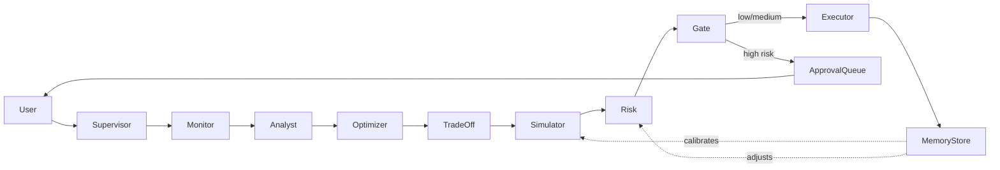

# Baburao - Intelligent Infrastructure Cost Optimizer

AI-powered multi-agent system that continuously monitors, analyzes, and executes cloud cost optimizations with human-in-the-loop approval for high-risk actions.

**Live API:** https://hackoasis-26.onrender.com  
**CLI Tool:** `baburao` - Production-grade terminal interface

---

## Architecture



---

## Agents

| Agent | Role |
|-------|------|
| **Supervisor** | Orchestrates the pipeline; routes user queries to the right agent |
| **Monitor** | Ingests live/demo cloud spend data across AWS, GCP, Azure |
| **Analyst** | Identifies waste patterns, idle resources, and anomalies |
| **Optimizer** | Generates ranked cost-saving recommendations |
| **TradeOff** | Weighs cost savings against performance and reliability impact |
| **Simulator** | Projects savings and risk using historical memory |
| **Risk** | Scores each action; classifies as low / medium / high risk |
| **Executor** | Applies approved optimizations and logs outcomes |

---

## Live API

Deployed at: **https://hackoasis-26.onrender.com**
- API v1: https://hackoasis-26.onrender.com/api/v1
- Swagger UI: https://hackoasis-26.onrender.com/docs
- Health Check: https://hackoasis-26.onrender.com/health

---

## Setup

### Dashboard
```bash
pip install -r requirements.txt
cp .env.example .env  # add your GROQ_API_KEY
streamlit run app.py
```

### CLI (Baburao)
```bash
cd cli && go build -o baburao .
export BABURAO_API_URL=https://hackoasis-26.onrender.com

# Basic commands
./baburao run                    # Run optimization cycle
./baburao approve                # Interactive approval
./baburao chat "what is wasting the most money?"
./baburao status                 # Current status
./baburao log                    # Action history

# Advanced commands
./baburao version                # Show version
./baburao config init            # Initialize config
./baburao k8s scan               # Kubernetes waste scan
./baburao prometheus idle        # Prometheus idle instances
./baburao terraform plan <id> <action>  # Generate Terraform plan
```

**Features:**
- ✅ Color-coded output
- ✅ Table formatting (json, yaml, table)
- ✅ Configuration file support (~/.baburao/config.yaml)
- ✅ Filtering (--cloud, --env, --risk)
- ✅ Debug mode
- ✅ Version information

Get a free Groq API key at https://console.groq.com

---

## API v1 Endpoints

### Core Optimization
- `POST /api/v1/run` - Execute optimization cycle
- `GET /api/v1/status` - Get cycle status
- `GET /api/v1/queue` - Get approval queue
- `POST /api/v1/approve` - Approve actions
- `POST /api/v1/rollback` - Rollback an action
- `POST /api/v1/reset` - Reset demo state

### Data & Queries
- `GET /api/v1/resources` - Query resources (with filters)
- `GET /api/v1/opportunities` - Get opportunities (with filters)
- `GET /api/v1/log` - Action log (with pagination)
- `POST /api/v1/chat` - Natural language queries

### Health & Monitoring
- `GET /health` - Health check
- `GET /api/v1/status` - Detailed status

**Query Parameters:**
- `cloud` - Filter by cloud provider (aws, gcp, azure)
- `env` - Filter by environment (prod, staging, dev)
- `risk` - Filter by risk tier (low, medium, high)
- `limit` - Pagination limit (default: 100)
- `offset` - Pagination offset (default: 0)

**Legacy Endpoints:** Old endpoints (`/run`, `/approve`, etc.) still work but are deprecated. Use `/api/v1/*` for new integrations.

---

## 2-Minute Demo

1. Open http://localhost:8501
2. Check **Demo Mode** in the sidebar
3. Click **Run Optimization Cycle**
4. Watch 8 agents reason in the **Agent Trace** tab
5. Review **Cost Overview** — see identified savings
6. Go to **Approval Queue** — approve or reject high-risk actions
7. Check **Action Log** for executed optimizations
8. Try Chat: *"What is wasting the most money?"*

---

## Tech Stack

- **LangGraph** — agent orchestration and state machine
- **LangChain** — LLM tooling and prompt management
- **Groq** — free, fast LLM inference (llama3)
- **Streamlit** — interactive UI
- **Plotly** — cost visualizations
