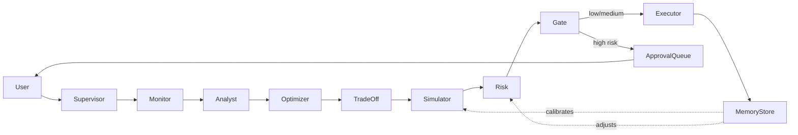

# Intelligent Infrastructure Cost Optimizer

AI-powered multi-agent system that continuously monitors, analyzes, and executes cloud cost optimizations with human-in-the-loop approval for high-risk actions.

---

## Architecture



---

## Agents

| Agent | Role |
|-------|------|
| **Supervisor** | Orchestrates the pipeline; routes user queries to the right agent |
| **Monitor** | Ingests live/demo cloud spend data across AWS, GCP, Azure |
| **Analyst** | Identifies waste patterns, idle resources, and anomalies |
| **Optimizer** | Generates ranked cost-saving recommendations |
| **TradeOff** | Weighs cost savings against performance and reliability impact |
| **Simulator** | Projects savings and risk using historical memory |
| **Risk** | Scores each action; classifies as low / medium / high risk |
| **Executor** | Applies approved optimizations and logs outcomes |

---

## Live API

Deployed at: **https://hackoasis-26.onrender.com**
- Swagger UI: https://hackoasis-26.onrender.com/docs
- Status: https://hackoasis-26.onrender.com/status

---

## Setup

### Dashboard
```bash
pip install -r requirements.txt
cp .env.example .env  # add your GROQ_API_KEY
streamlit run app.py
```

### CLI
```bash
cd cli && go build -o finops .
export FINOPS_API_URL=https://hackoasis-26.onrender.com
./finops run
./finops approve
./finops chat "what is wasting the most money?"
```

Get a free Groq API key at https://console.groq.com

---

## 2-Minute Demo

1. Open http://localhost:8501
2. Check **Demo Mode** in the sidebar
3. Click **Run Optimization Cycle**
4. Watch 8 agents reason in the **Agent Trace** tab
5. Review **Cost Overview** — see identified savings
6. Go to **Approval Queue** — approve or reject high-risk actions
7. Check **Action Log** for executed optimizations
8. Try Chat: *"What is wasting the most money?"*

---

## Tech Stack

- **LangGraph** — agent orchestration and state machine
- **LangChain** — LLM tooling and prompt management
- **Groq** — free, fast LLM inference (llama3)
- **Streamlit** — interactive UI
- **Plotly** — cost visualizations
